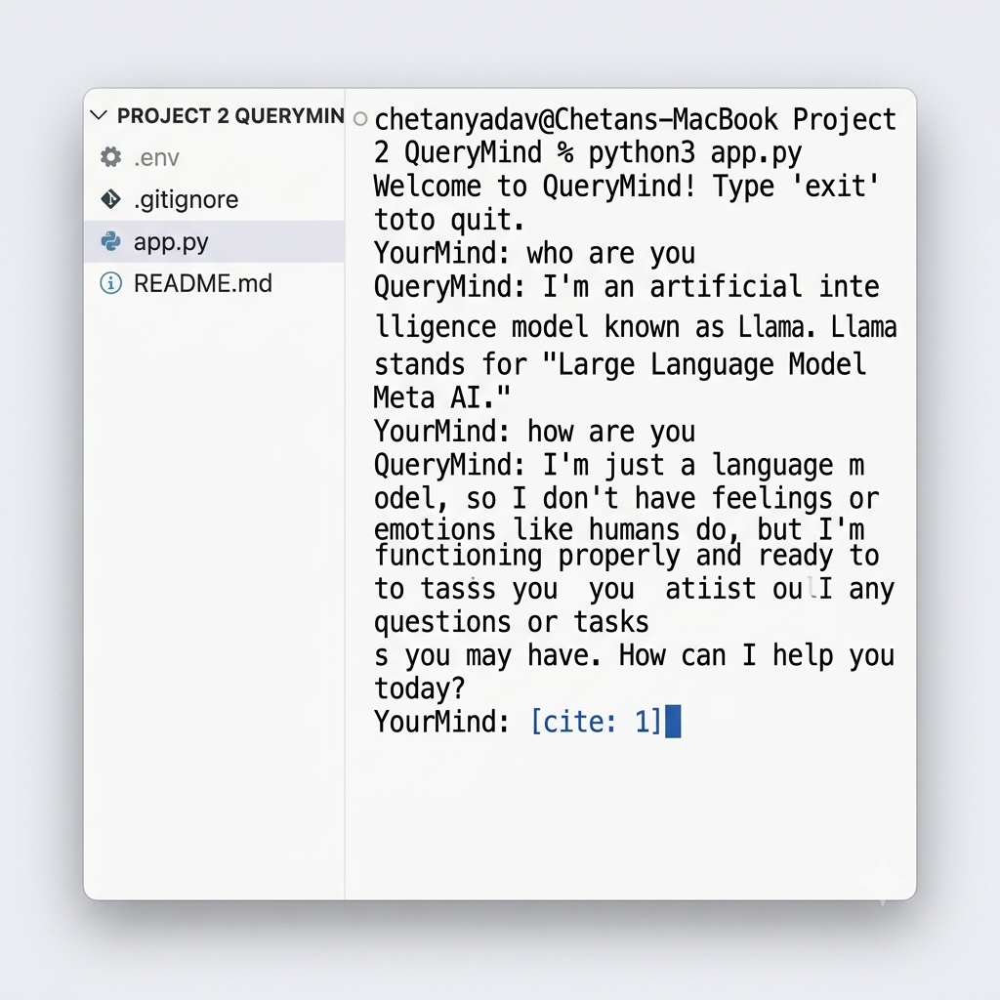

# QueryMind 🧠

An AI-powered command-line chatbot built with **Python** and the **Groq API**, enabling fast and intelligent conversations using Meta's **Llama 3.3 70B Versatile** language model. QueryMind provides a lightweight, secure, and interactive terminal experience while demonstrating API integration, environment variable management, and AI application development.

<a href="https://github.com/chetan202022/QueryMind" target="_blank">
  
</a>

---

## 📸 Preview

<p align="center">

</p>

---

## 📋 Table of Contents

- [Features](#features)
- [Tech Stack](#tech-stack)
- [Installation](#installation)
- [Configuration](#configuration)
- [Usage](#usage)
- [Architecture](#architecture)
- [Project Structure](#project-structure)
- [Contributing](#contributing)
- [Author](#author)

---

<h2 id="features">✨ Features</h2>

- **AI-Powered Conversations** using Groq's ultra-fast inference API
- **Llama 3.3 70B Versatile** large language model
- **Interactive Command-Line Interface**
- **Secure API Key Management** using environment variables
- **Configurable AI Parameters** such as temperature and max tokens
- **Lightweight Architecture** with minimal dependencies
- **Cross-Platform Compatibility** (Windows, macOS, Linux)
- **Beginner-Friendly Codebase** with clean project structure

---

<h2 id="tech-stack">🛠️ Tech Stack</h2>

### Core Technologies

| Technology | Purpose |
|------------|---------|
| Python | Programming Language |
| Groq API | AI Inference |
| Llama 3.3 70B Versatile | Large Language Model |
| Requests | HTTP Client |
| python-dotenv | Environment Variable Management |

---

<h2 id="installation">⚙️ Installation</h2>

### Prerequisites

- Python 3.9+
- Groq API Key
- pip

### Clone Repository

```bash
git clone https://github.com/chetan202022/QueryMind.git

cd QueryMind
```

### Create Virtual Environment (Recommended)

#### Windows

```bash
python -m venv venv

venv\Scripts\activate
```

#### macOS/Linux

```bash
python3 -m venv venv

source venv/bin/activate
```

### Install Dependencies

```bash
pip install -r requirements.txt
```

---

<h2 id="configuration">🔧 Configuration</h2>

Create a `.env` file in the project root.

```env
GROQ_API_KEY=your_groq_api_key
```

### AI Configuration

The chatbot uses the following default settings:

```python
model = "llama-3.3-70b-versatile"

temperature = 0

max_tokens = 100
```

These values can be customized according to your use case.

---

<h2 id="usage">🚀 Usage</h2>

Run the chatbot:

```bash
python main.py
```

Example interaction:

```text
Welcome to QueryMind!
Type 'exit' to quit.

YourMind:
> Explain Machine Learning.

QueryMind:
Machine Learning is a branch of Artificial Intelligence that enables computers to learn patterns from data and improve their predictions without being explicitly programmed.
```

Exit the application anytime using:

```text
exit
```

---

<h2 id="architecture">🏗️ Architecture</h2>

```text
User
   │
   ▼
Command-Line Interface
   │
   ▼
Python Application
   │
   ▼
Groq API
   │
   ▼
Llama 3.3 70B Versatile
   │
   ▼
AI Response
```

---

<h2 id="project-structure">📁 Project Structure</h2>

```text
QueryMind/
│
├── .env
├── .gitignore
├── app.py
├── requirements.txt
├── README.md
└── Screenshots/
    └── demo.png
```

---

<h2 id="contributing">🤝 Contributing</h2>

Contributions are welcome!

To contribute:

1. Fork the repository
2. Create a new feature branch

```bash
git checkout -b feature/AmazingFeature
```

3. Commit your changes

```bash
git commit -m "Add AmazingFeature"
```

4. Push to GitHub

```bash
git push origin feature/AmazingFeature
```

5. Open a Pull Request

---

<h2 id="author">👨‍💻 Author</h2>

# Chetan Yadav

<p>

<a href="https://github.com/chetan202022">

</a>

<a href="https://linkedin.com/in/chetan-yadav-a21b0a289">

</a>

<a href="https://leetcode.com/u/Chetan__10/">

</a>

</p>

---

## ⭐ Support

If you found this project useful, consider:

- ⭐ Starring the repository
- 🍴 Forking the project
- 📝 Opening issues for suggestions
- 🚀 Sharing it with others

---
